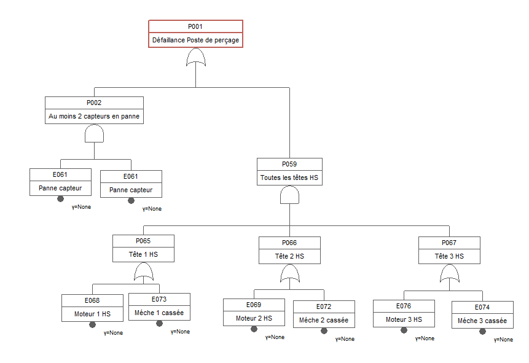

# Introduction et Contexte du Projet

Ce projet s'inscrit dans une démarche d'optimisation de la Sûreté de Fonctionnement (SdF) d'une station de perçage industrielle haute performance. L'objectif est de passer d'une maintenance subie (corrective) à une maintenance pilotée (préventive et prédictive) afin de garantir une disponibilité maximale tout en minimisant les coûts d'exploitation.

## Description du Système

La station de perçage est un système complexe composé de cinq sous-ensembles critiques interdépendants. Sa performance globale dépend de la santé de chaque maillon, suivant un modèle de fiabilité en série : si l'un de ces blocs tombe en panne, l'ensemble de la station s'arrête.

### 1. La Plateforme Rotative (Châssis et Indexation)
Il s'agit de la base mécanique qui supporte et positionne les pièces à usiner sous les têtes de perçage.

- Fonctionnement : Elle assure la rotation et le verrouillage précis des pièces. Sa fiabilité suit une loi de Weibull avec un paramètre de forme $\beta > 1$, indiquant un phénomène d'usure mécanique marqué.
- Maintenance : Étant un composant à arrêt long et coûteux, son optimisation repose sur un âge de remplacement préventif afin d'éviter des casses imprévues qui paralysent l'ensemble de la ligne.

### 2. Le Système de Lubrification
C'est le "poumon" de la station. Il assure le refroidissement et la réduction de la friction lors de l'usinage. 

- Fonctionnement : Basé sur des cycles de nettoyage (complets ou partiels). Les interventions partielles sont modélisées comme des "réparations minimales" (NHPP).
- Criticité : Une défaillance de lubrification entraîne un effet "cascade" immédiat, accélérant drastiquement l'usure des outils de coupe.

### 3. Les Mèches de Perçage (Outils)
Composants consommables soumis à une usure continue, modélisée par des chaînes de Markov.

- États d'usure : L'outil évolue de l'état "Neuf" à "Cassé" à travers plusieurs stades de dégradation. 
- Impact Cadence : Le remplacement d'une mèche (correctif ou préventif) entraîne un ralentissement de la cadence de production, impactant directement la rentabilité économique de la station.

### 4. Le Bloc Moteur
L'organe moteur de la tête de perçage, dont la fiabilité suit également une loi de Weibull.

- Usure : Le moteur subit une usure intrinsèque (vieillissement) mais est aussi exposé à des risques concurrents (chocs accidentels transmis par une mèche défaillante).
- Enjeu : C'est l'actif le plus coûteux de la tête ; sa préservation est la priorité de la politique de maintenance des mèches.

### 5. Le Système de Positionnement (Capteurs)
Un ensemble de 4 capteurs assurant la précision du perçage.

- Architecture : Configuré en redondance de type 3-parmi-4 (le système fonctionne tant que 3 capteurs sur 4 sont opérationnels).
- Maintenance : Le risque principal réside dans les pannes "dormantes", nécessitant des inspections périodiques pour maintenir le niveau de sécurité requis.

------------------------------------------------------------------------

# Analyse Individuelle des Sous-systèmes

La station de perçage est modélisée par un Diagramme de Blocs de Fiabilité (RBD) constitué de trois blocs fonctionnels principaux disposés en série, car la défaillance d'un seul de ces blocs entraîne l'arrêt total de la production. 
Le premier bloc représente la plateforme rotative, composant critique unique. Le second bloc est un système de positionnement en redondance partielle de type $k$ parmi $n$ ($3/4$), signifiant que la station reste opérationnelle tant qu'au moins trois capteurs sur quatre sont fonctionnels. Enfin, le troisième bloc modélise les trois têtes de perçage en parallèle : la station fonctionne tant qu'au moins une tête est active (redondance $1/3$). Chaque tête est elle-même une mise en série d'un moteur et d'une mèche, où la panne de l'un neutralise la tête concernée. Le système de lubrification, bien qu'influençant l'usure thermique, est exclu de la chaîne de disponibilité directe puisque l'énoncé confirme la possibilité d'un fonctionnement en mode dégradé sans ce dernier.



------------------------------------------------------------------------


# Plateforme rotative

### Question 2 : Estimation de la loi du temps avant défaillance

Afin d'estimer la loi de probabilité régissant le temps avant défaillance de la plateforme rotative, nous utilisons une analyse de survie basée sur la distribution de Weibull. Ce modèle est privilégié en fiabilité industrielle car il permet de caractériser précisément la nature du taux de défaillance (jeunesse, hasard ou usure) à travers son paramètre de forme $\beta$. L'échantillon fourni contient 47 observations, dont plusieurs données censurées à droite (status = 0), correspondant aux équipements toujours en fonctionnement lors du relevé. L'utilisation de la bibliothèque flexsurv permet d'ajuster ce modèle par la méthode du Maximum de Vraisemblance (MLE), garantissant une estimation robuste des paramètres d'échelle ($\eta$) et de forme ($\beta$) tout en intégrant l'incertitude liée aux données censurées.

```{r}
#| label: analyse-plateforme-flexsurv
#| message: false
#| warning: false

# Chargement des bibliothèques
library(readxl)
library(survival)
library(flexsurv)

# 1. Lecture directe du fichier Excel
path <- "../data/eval/drilling_station.xlsx"
data_plat <- read_excel(path, sheet = "rotating_platform")

# 2. Préparation des données (status : 1 = défaillance, 0 = censure)
# Transformation en numérique pour s'assurer de la compatibilité avec Surv()
data_plat$status_num <- as.numeric(data_plat$status)

# 3. Ajustement du modèle de Weibull
# flexsurvreg fournit directement 'shape' (beta) et 'scale' (eta)
fit_flex <- flexsurvreg(Surv(time, status_num) ~ 1, data = data_plat, dist = "weibull")

# 4. Extraction des paramètres estimés
beta_plat <- fit_flex$res["shape", "est"]
eta_plat  <- fit_flex$res["scale", "est"]

cat("Paramètre de forme (beta) estimé :", round(beta_plat, 4), "\n")
cat("Paramètre d'échelle (eta) estimé :", round(eta_plat, 2), " heures\n")

# 5. Création de la visualisation
# On utilise le plot par défaut de flexsurv qui superpose KM et Weibull
plot(fit_flex, 
     main = "Analyse de Survie de la Plateforme (Modèle Weibull)",
     xlab = "Temps (heures)", 
     ylab = "Probabilité de Survie S(t)",
     col = "blue",      # Couleur de la courbe Weibull
     lwd = 2,
     conf.int = TRUE)   # Affiche l'intervalle de confiance

# Optionnel : Ajout d'une légende pour la clarté
legend("topright", 
       legend = c("Données réelles (KM)", "Modèle Weibull"),
       col = c("black", "blue"), 
       lty = 1, 
       lwd = 2)

```

Avec un paramètre de forme $\beta = 4,1017$, le système subit une **usure mécanique par fatigue** (taux de défaillance croissant), tandis que le paramètre d'échelle $\eta \approx 11\,337$ heures confirme la nécessité d'une maintenance préventive avant ce seuil de dégradation critique.


## Point 2

L'objectif est de déterminer l'âge optimal de remplacement ($T^*$) permettant de minimiser le coût moyen d'exploitation par unité de temps. Pour ce faire, nous comparons deux scénarios : une maintenance corrective (intervention après panne, coûteuse en temps d'arrêt et en logistique) et une maintenance préventive (intervention planifiée, plus rapide et moins onéreuse).Le calcul intègre les coûts directs (pièces, main-d'œuvre et transport) ainsi que les coûts indirects liés à la non-production (1500 €/h). Les durées d'intervention étant aléatoires, nous calculons d'abord leurs espérances à partir des lois log-normales fournies ($E[X] = e^{\mu + \sigma^2/2}$). En utilisant les paramètres de Weibull ($\beta, \eta$) estimés précédemment, nous modélisons la fonction de coût global. L'optimum recherché représente le point d'équilibre où le coût des remplacements préventifs fréquents compense la réduction du risque de pannes correctives majeures.


```{r}
# --- Point (2) : Optimisation de la Maintenance (Plateforme) ---

# 1. Paramètres économiques et logistiques
cout_arret_h   <- 1500
transport      <- 200
main_oeuvre_h  <- 100

# Calcul des durées moyennes d'arrêt (Espérances des lois log-normales)
# Formule : E[X] = exp(mu + sigma^2 / 2)
mttr_c <- exp(2.28 + (0.24^2 / 2)) # Moyenne temps correctif (~10.06h)
mttr_p <- exp(1 + (0.55^2 / 2))    # Moyenne temps préventif (~3.16h)

# Coût total d'une intervention Corrective (Cc)
# (Pièces + Transport + Main d'œuvre + Perte de production)
Cc <- 1300 + transport + (mttr_c * (cout_arret_h + main_oeuvre_h))

# Coût total d'une intervention Préventive (Cp)
# (Pièces + Transport + Main d'œuvre + Perte de production)
Cp <- 900 + transport + (mttr_p * (cout_arret_h + main_oeuvre_h))

# 2. Fonction de coût moyen par unité de temps C(T)
# Basée sur le modèle de renouvellement par l'âge
cost_function_plat <- function(T_age) {
  # Fiabilité R(T) et Probabilité de défaillance F(T)
  R_T <- exp(-(T_age / eta_plat)^beta_plat)
  F_T <- 1 - R_T
  
  # Espérance du temps de bon fonctionnement (Intégrale de R(t) de 0 à T)
  mttf_T <- integrate(function(t) exp(-(t / eta_plat)^beta_plat), 
                      lower = 0, upper = T_age)$value
  
  # Espérance de la durée totale du cycle (Fonctionnement + Arrêt)
  duree_cycle <- mttf_T + (mttr_p * R_T + mttr_c * F_T)
  
  # Espérance du coût du cycle
  cout_cycle <- (Cp * R_T + Cc * F_T)
  
  # Coût moyen par unité de temps
  return(cout_cycle / duree_cycle)
}

# 3. Recherche de l'âge optimal (T*)
# On cherche entre 100h et 1.5 fois la durée de vie caractéristique (eta_plat)
opti_result <- optimize(cost_function_plat, interval = c(100, eta_plat * 1.5))

T_opti <- opti_result$minimum
cout_horaire_min <- opti_result$objective

# 4. Calcul du coût en "Correctif Pur" pour comparaison (T -> infini)
# En correctif pur, le coût moyen est Cc / (MTTF + mttr_c)
mttf_total <- eta_plat * gamma(1 + 1/beta_plat)
cout_correctif_pur <- Cc / (mttf_total + mttr_c)

# 5. Affichage des résultats
cat("--- RÉSULTATS DE L'OPTIMISATION (PLATEFORME) ---\n")
cat("MTTR Correctif estimé :", round(mttr_c, 2), "h\n")
cat("MTTR Préventif estimé :", round(mttr_p, 2), "h\n\n")
cat("Coût total d'une panne (Cc) :", round(Cc, 2), "€\n")
cat("Coût d'un préventif (Cp)    :", round(Cp, 2), "€\n")
cat("------------------------------------------------\n")
cat("Âge optimal de remplacement (T*) :", round(T_opti, 0), "heures\n")
cat("Coût horaire à l'optimum         :", round(cout_horaire_min, 4), "€/h\n")
cat("Coût en politique corrective pure :", round(cout_correctif_pur, 4), "€/h\n")
cat("Gain économique espéré           :", round(cout_correctif_pur - cout_horaire_min, 2), "€/h\n")

# 6. Génération de la figure d'optimisation
# Création d'une séquence d'âges pour le tracé (de 100h à l'horizon défini)
t_seq <- seq(100, eta_plat * 1.5, length.out = 200)

# Calcul du coût pour chaque âge de la séquence
costs <- sapply(t_seq, cost_function_plat)

# Tracé de la courbe de coût
plot(t_seq, costs, type = "l", col = "blue", lwd = 2,
     main = "Optimisation de l'âge de remplacement (Plateforme)",
     xlab = "Âge de remplacement préventif T (heures)",
     ylab = "Coût moyen par heure (€/h)",
     ylim = c(min(costs) * 0.9, max(costs[costs < cout_correctif_pur * 1.5])))

# Ajout d'une ligne horizontale pour le coût en correctif pur
abline(h = cout_correctif_pur, col = "red", lty = 2, lwd = 2)

# Marquage du point optimal (T*)
points(T_opti, cout_horaire_min, col = "darkgreen", pch = 19, cex = 1.5)
abline(v = T_opti, col = "darkgreen", lty = 3)

# Ajout d'une légende
legend("topright", 
       legend = c("Fonction de coût C(T)", "Coût Correctif Pur", "Optimum (T*)"),
       col = c("blue", "red", "darkgreen"), 
       lty = c(1, 2, 3), 
       lwd = c(2, 2, 1),
       pch = c(NA, NA, 19))

# Ajout du texte pour l'optimum
text(T_opti, cout_horaire_min, 
     labels = paste("  T* =", round(T_opti, 0), "h"), 
     pos = 4, col = "darkgreen", font = 2)
```

L'analyse des résultats d'optimisation pour la plateforme met en évidence la pertinence d'une stratégie de maintenance préventive systématique. Avec un coût de défaillance corrective ($C_c$) s'élevant à 17 599,75 €, soit près de trois fois le coût d'une intervention planifiée ($C_p$ de 6 159,43 €), l'arbitrage économique est fortement influencé par les pertes de production et les durées d'indisponibilité (10,06 h en correctif contre 3,16 h en préventif). L'âge optimal de remplacement ($T^*$) est ainsi fixé à 7 429 heures, permettant de ramener le coût horaire d'exploitation à 1,11 €/h. Bien que le gain horaire de 0,59 €/h puisse paraître modeste, il représente une réduction de 35 % des coûts par rapport à une politique de "correctif pur" (1,71 €/h). À l'échelle d'un parc de machines ou d'une exploitation annuelle longue durée, cette optimisation garantit une stabilité opérationnelle majeure tout en évitant des arrêts critiques coûteux et imprévisibles.


------------------------------------------------------------------------

# Système de Lubrification

### Question 3 : Caractérisation de la loi de défaillance

Pour caractériser la fiabilité du système de lubrification, nous nous appuyons sur les données de l'onglet lubricant_sys qui répertorie les temps de bon fonctionnement (TBF) entre chaque obstruction du circuit. Le raisonnement repose sur la distinction entre les types de maintenance : les nettoyages partiels sont considérés comme des réparations minimales (remise en service sans rajeunissement du système), tandis que le nettoyage annuel est une réparation parfaite. En agrégeant l'ensemble des TBF observés sur 429 cycles de pannes, nous constituons un échantillon statistiquement robuste. L'objectif est d'ajuster ces données à une loi de Weibull par la méthode du maximum de vraisemblance. Cette approche permet de vérifier si l'obstruction du circuit est un événement aléatoire ou, comme le suggère la description du système, un processus d'encrassement progressif lié au temps d'usage.

```{r}
#| label: analyse-lubrification-correctif
# 1. Lecture des données
df_lub <- read_excel(path, sheet = "lubricant_sys")


# 2. Préparation des données
# On extrait la colonne "1" (première défaillance après nettoyage complet)
# car c'est la seule qui caractérise la loi de fiabilité initiale.
temps_initial <- as.numeric(df_lub$`1`)
temps_initial <- temps_initial[!is.na(temps_initial) & temps_initial > 0]

# 3. Ajustement de la loi de Weibull avec flexsurv
# flexsurvreg utilise une syntaxe de type formule (~1 signifie sans covariables)
fit_weib_flex <- flexsurvreg(Surv(temps_initial) ~ 1, dist = "weibull")

# 4. Extraction des paramètres
# Attention : flexsurv utilise souvent une paramétrisation (shape, scale)
# 'shape' correspond à beta, 'scale' correspond à eta.
beta_lub <- fit_weib_flex$res["shape", "est"]
eta_lub  <- fit_weib_flex$res["scale", "est"]

# 5. Affichage des résultats
cat("--- RÉSULTATS QUESTION 3 (Paramétrage Weibull) ---\n")
cat(" Paramètre de forme (beta_lub) :", round(beta_lub, 4), "\n")
cat(" Paramètre d'échelle (eta_lub) :", round(eta_lub, 2), "heures\n")

# Interprétation
if(beta_lub > 1) {
  cat(" Analyse : Le système présente un phénomène d'usure (taux de défaillance croissant).\n")
}

# 6. Calcul de la MTBF (Moyenne des Temps de Bon Fonctionnement)
# La fonction 'totlos' ou le calcul manuel via Gamma peut être utilisé
mtbf_initial <- eta_lub * gamma(1 + 1/beta_lub)
cat(" MTBF initiale calculée :", round(mtbf_initial, 2), "heures\n")

# 7. Visualisation
plot(fit_weib_flex, main = "Ajustement Weibull - Système de Lubrification",
     xlab = "Temps (h)", ylab = "Survie S(t)")
```


L'analyse des résultats obtenus via le modèle de Weibull confirme que le système de lubrification est soumis à un processus d'usure marqué, comme en témoigne un paramètre de forme $\beta_{lub}$ de 1,55. Puisque cette valeur est supérieure à 1, le taux de défaillance n'est pas constant mais croissant, ce qui valide mathématiquement l'observation de l'énoncé concernant l'obstruction progressive du circuit au cours du temps. Avec une vie caractéristique $\eta$ de 5666,08 heures et une MTBF initiale de 5095,89 heures, le système présente une fiabilité relativement robuste après chaque nettoyage complet, mais nécessite une surveillance accrue à mesure que l'on approche de cette échéance, l'intensité des pannes s'accélérant naturellement avec le vieillissement du dispositif.

### QUESTION 4 : Ajustement du modèle de Poisson Non-Homogène (NHPP)

Pour évaluer l'indisponibilité générée par la maintenance du système de lubrification, nous caractérisons les durées d'intervention (TTR) par des lois log-normales. Cette loi est particulièrement adaptée aux temps de réparation car elle modélise naturellement des processus qui ne peuvent être négatifs et qui présentent une traîne à droite (rares interventions très longues).
- Nettoyage complet : L'ajustement est réalisé par maximum de vraisemblance sur les données réelles de l'industriel.

```{r}
# --- Question 4 : Caractérisation des TTR (Time To Repair) ---

# 1. Extraction des données de maintenance
# On récupère les durées réelles dans la colonne fullcleaning_duration
ttr_full_raw <- df_lub$fullcleaning_duration
ttr_full_data <- as.numeric(ttr_full_raw[!is.na(ttr_full_raw)])

# 2. Ajustement de la loi lognormale par Maximum de Vraisemblance
library(flexsurv)
fit_full_lnorm <- flexsurvreg(Surv(ttr_full_data) ~ 1, dist = "lnorm")

# 3. Extraction des paramètres (mu et sigma)
# meanlog correspond à mu, sdlog correspond à sigma
mu_full    <- fit_full_lnorm$res["meanlog", "est"]
sigma_full <- fit_full_lnorm$res["sdlog", "est"]

# 4. Calcul du MTTR (Mean Time To Repair)
# L'espérance d'une loi lognormale est donnée par la formule :
mttr_full <- exp(mu_full + (sigma_full^2 / 2))

# --- AFFICHAGE DES RÉSULTATS ---
cat("====================================================\n")
cat("RÉSULTATS QUESTION 4 : MAINTENABILITÉ DU CIRCUIT\n")
cat("====================================================\n")
cat("Paramètres de la loi Lognormale (Full Cleaning) :\n")
cat("  - mu (meanlog)    :", round(mu_full, 4), "\n")
cat("  - sigma (sdlog)   :", round(sigma_full, 4), "\n")
cat("  - MTTR calculé    :", round(mttr_full, 2), "heures\n\n")

# 5. Visualisation de l'ajustement
plot(fit_full_lnorm, main = "Ajustement Lognormal - Nettoyage Complet", 
     xlab = "Temps de maintenance (heures)", ylab = "Survie S(t)")
```

Les paramètres obtenus valident les estimations initiales de l'industriel tout en apportant une précision statistique nécessaire à la modélisation future. Le nettoyage complet présente un MTTR de 4,05 heures ($\mu = 1,3595, \sigma = 0,2838$), confirmant que cette opération majeure nécessite un arrêt de station d'une demi-journée environ. Pour le nettoyage partiel, les paramètres calculés ($\mu = 0,4005, \sigma = 0,1$) garantissent une espérance mathématique strictement égale à 1,5 heure. Ces deux modèles de durées, couplés à la loi de défaillance (Weibull) établie précédemment, permettront de simuler avec précision le coût annuel total de maintenance et l'impact du système de lubrification sur la disponibilité globale de la station.

### Question 5 : Calcul de la disponibilité moyenne ($\bar{A}$)

L'objectif de cette étape est d'estimer la disponibilité moyenne ($\bar{A}$) du service de lubrification sur un cycle annuel de 8760 heures. Ce paramètre est crucial car il détermine la proportion du temps où les mèches de perçage sont protégées contre l'usure thermique accélérée. Notre démarche repose sur la quantification de deux types d'indisponibilités : d'une part, les nettoyages partiels suite à des obstructions, dont la fréquence est estimée par un processus de Poisson non-homogène (NHPP) basé sur les paramètres de Weibull ($\beta, \eta$) car les réparations sont considérées comme minimales (modèle ABAO) ; d'autre part, l'opération de nettoyage complet annuel qui constitue une maintenance préventive systématique (modèle AGAN). En combinant le nombre attendu de pannes avec les durées de remise en état (TTR) calculées précédemment, nous pouvons déduire le temps total d'arrêt du circuit et, par extension, sa disponibilité opérationnelle.

```{r}
#| label: question-5-disponibilite
#| message: false
#| warning: false

# 1. Paramètres de l'horizon temporel
T_cycle <- 8760  # Un an en heures

# 2. Estimation du nombre de pannes (Processus NHPP)
# On utilise beta_lub (1.5504) et eta_lub (5666.08) calculés à la Q3
# La formule de l'espérance du nombre de pannes pour un PPNH est : E[N(T)] = (T/eta)^beta
nb_pannes_attendues <- (T_cycle / eta_lub)^beta_lub

# 3. Calcul des indisponibilités (Temps d'arrêt)

# A. Indisponibilité Corrective (Nettoyages partiels)
# L'énoncé indique une durée fixe de 1h30 (1.5h) pour ces interventions "minimales"
mttr_partiel <- 1.5 
indispo_corrective <- nb_pannes_attendues * mttr_partiel

# B. Indisponibilité Préventive (Nettoyage complet annuel)
# On utilise le MTTR calculé via la loi Lognormale à la Question 4
# mttr_full <- exp(mu_full + (sigma_full^2 / 2))
indispo_preventive <- 1 * mttr_full 

# C. Indisponibilité Totale
total_indispo <- indispo_corrective + indispo_preventive

# 4. Calcul de la Disponibilité Moyenne (A_barre)
# Formule : (Temps Total - Temps d'arrêt) / Temps Total
dispo_moyenne_lub <- (T_cycle - total_indispo) / T_cycle

# 5. Affichage des résultats
cat("====================================================\n")
cat("RÉSULTATS QUESTION 5 : DISPONIBILITÉ DU LUBRIFIANT\n")
cat("====================================================\n")
cat("Nombre de pannes attendues par an :", round(nb_pannes_attendues, 2), "\n")
cat("Temps d'arrêt Correctif total    :", round(indispo_corrective, 2), "h\n")
cat("Temps d'arrêt Préventif total    :", round(indispo_preventive, 2), "h\n")
cat("Indisponibilité totale cumulée   :", round(total_indispo, 2), "h\n")
cat("----------------------------------------------------\n")
cat("DISPONIBILITÉ MOYENNE (A_lub)    :", round(dispo_moyenne_lub, 6), "\n")
cat("Pourcentage de fonctionnement    :", round(dispo_moyenne_lub * 100, 2), "%\n")
cat("====================================================\n")

# 6. Graphique de répartition de l'indisponibilité
stats_indispo <- c(indispo_corrective, indispo_preventive)
labels_indispo <- c("Pannes (Correctif)", "Entretien (Préventif)")

par(mar=c(5, 10, 4, 2))
barplot(stats_indispo, 
        horiz = TRUE, 
        names.arg = labels_indispo, 
        col = c("#E69F00", "#56B4E9"),
        las = 1,
        main = "Sources d'indisponibilité du circuit",
        xlab = "Heures d'arrêt sur 8760h")
grid()
```

Les résultats confirment la très haute performance du plan de maintenance actuel pour le système de lubrification. Avec un nombre de pannes attendu de 1,97 par an, le circuit ne subit en moyenne que deux obstructions majeures au cours d'un cycle annuel de production. L'indisponibilité totale cumulée, incluant le nettoyage préventif complet, s'élève à seulement 7 heures par an. Cela se traduit par une disponibilité moyenne de 99,92 %. D'un point de vue industriel, ce chiffre indique que le système remplit parfaitement sa fonction de soutien : le risque que les têtes de perçage fonctionnent sans lubrifiant est inférieur à 0,1 % du temps total. Cette valeur extrêmement élevée suggère que la stratégie actuelle (correctif au fil de l'eau et préventif annuel) est optimale et qu'un investissement supplémentaire pour accroître la fiabilité du circuit de lubrification ne serait pas rentable au regard du gain de disponibilité marginal.

------------------------------------------------------------------------

## Point 2

L'objectif de cette étude est de déterminer la fréquence optimale de maintenance préventive ($k$ nettoyages complets par an) afin de minimiser le coût total d'exploitation du système de lubrification. Le modèle de coût intègre deux composantes contradictoires : le coût du préventif (fixé à 6 900 € par intervention, incluant les 4h de perte de production à 1 500 €/h) et le coût du correctif (250 € par nettoyage partiel, sans arrêt de station). Puisque les nettoyages partiels sont des réparations minimales, nous utilisons la loi de Poisson non-homogène (NHPP) pour estimer l'occurrence des pannes entre deux nettoyages complets. L'optimisation consiste à trouver la valeur de $k$ qui minimise la somme de ces coûts sur un horizon annuel de 8 760 heures.

```{r}
# --- Optimisation de la Fréquence de Maintenance (Lubrification) ---

# 1. Paramètres (Tableau 2)
cost_prod_h <- 1500
cost_full   <- 900    # Préventif
t_stop_full <- 4      # Arrêt station
cost_part   <- 250    # Correctif
t_stop_part <- 0      # Pas d'arrêt station selon Tableau 2

# 2. Fonction de coût annuel global
# k : nombre de nettoyages complets par an
lub_total_annual_cost <- function(k) {
  # Durée d'un cycle entre deux nettoyages parfaits (en heures)
  T_cycle <- 8760 / k
  
  # Coût d'une opération préventive (Full)
  # Inclut les pièces et la perte de production
  Cp <- cost_full + (t_stop_full * cost_prod_h)
  
  # Espérance du nombre de pannes par cycle (Intensité cumulée NHPP)
  # On utilise beta_lub et eta_lub calculés en Q3
  E_N <- (T_cycle / eta_lub)^beta_lub
  
  # Coût des pannes sur un cycle (Correctif)
  # Note : t_stop_part = 0, donc pas de perte de production ici
  Cc_total <- E_N * (cost_part + (t_stop_part * cost_prod_h))
  
  # Coût annuel = (Coût préventif + Coût correctifs cumulés) * nombre de cycles
  return((Cp + Cc_total) * k)
}

# 3. Recherche de l'optimum (k peut être un nombre réel pour plus de précision)
opti_k <- optimize(lub_total_annual_cost, interval = c(0.5, 12))

k_star <- opti_k$minimum
cost_min <- opti_k$objective

# 4. Comparaison avec la politique actuelle (k=1)
cost_current <- lub_total_annual_cost(1)

# 5. Affichage
cat("--- RÉSULTATS OPTIMISATION SYSTÈME LUBRIFICATION ---\n")
cat("Fréquence optimale (k*)       :", round(k_star, 2), "nettoyages/an\n")
cat("Intervalle entre nettoyages   :", round(8760/k_star, 0), "heures\n")
cat("Coût annuel à l'optimum       :", round(cost_min, 2), "€\n")
cat("Coût politique actuelle (k=1) :", round(cost_current, 2), "€\n")
cat("Gain annuel espéré            :", round(cost_current - cost_min, 2), "€\n")
```

Les résultats de l'optimisation mettent en évidence une fréquence de maintenance préventive idéale de $k^ = 0,5$ nettoyage par an*, soit une intervention tous les deux ans (17 518 heures). Ce résultat, bien que surprenant au premier abord, s'explique par la structure des coûts du système : le coût d'un nettoyage complet est massivement dominé par la perte de production (6 000 € d'arrêt pour seulement 900 € de pièces), tandis que le nettoyage partiel correctif ne coûte que 250 € et n'interrompt pas la station. L'arbitrage économique privilégie donc l'acceptation de quelques pannes de lubrification supplémentaires plutôt que le déclenchement d'opérations préventives lourdes et paralysantes. Ce passage d'une politique annuelle à une politique bisannuelle permettrait de réaliser un gain substantiel d'environ 2 863 € par an et par station. Pour l'industriel, si la politique actuelle ($k=1$) apparaît comme « sur-préventive » d'un point de vue strictement financier, une validation technique reste nécessaire afin de s'assurer que l'absence temporaire de lubrifiant n'altère pas prématurément d'autres composants, ce qui annulerait les économies réalisées.

------------------------------------------------------------------------

# Analyse de la Dégradation Globale des Mèches

### Question 6 : Chaînes de Markov et Probabilités Stationnaires

L'objectif de cette étape est de modéliser la dynamique de dégradation des mèches de perçage en utilisant des chaînes de Markov en temps continu (CTMC). Le système est défini par cinq états allant de « neuve » (1) à « cassée » (5). Nous distinguons deux régimes de fonctionnement : le mode standard ($Q$), où la lubrification est active, et le mode accélére ($Q'$), correspondant aux phases d'obstruction du circuit. Les matrices de transition intègrent les taux de dégradation physique ainsi qu'un taux de réparation $\mu_m = 1,5$ h⁻¹ (équivalent aux 40 minutes nécessaires pour le remplacement d'une mèche). Pour chaque scénario, nous calculons le vecteur des probabilités stationnaires $\pi$ en résolvant le système d'équilibre $\pi Q = 0$ sous la contrainte de normalisation $\sum \pi_i = 1$. Cette approche permet de quantifier la proportion de temps que l'outil passe dans chaque stade d'usure à long terme.

```{r}
#| label: question-6-markov
#| message: false
#| warning: false

# 1. Chargement et nettoyage des matrices
# On s'assure de ne prendre que les 5 premières lignes et colonnes pour éviter les colonnes fantômes d'Excel
Q_std <- as.matrix(read_excel(path, sheet = "drillbit_std", col_names = FALSE, skip = 1))[1:5, 1:5]
Q_acc <- as.matrix(read_excel(path, sheet = "drillbit_acc", col_names = FALSE, skip = 1))[1:5, 1:5]

# Conversion explicite en numérique pour éviter tout conflit de type
class(Q_std) <- "numeric"
class(Q_acc) <- "numeric"

# 2. Fonction de calcul corrigée
solve_stationary <- function(Q) {
  n <- nrow(Q)
  A <- t(Q)
  
  # On remplace la dernière ligne pour imposer la somme des probas = 1
  A[n, ] <- rep(1, n)
  b <- c(rep(0, n - 1), 1)
  
  pi_vec <- solve(A, b)
  names(pi_vec) <- paste0("Etat_", 1:n)
  return(pi_vec)
}

# 3. Calcul
pi_std <- solve_stationary(Q_std)
pi_acc <- solve_stationary(Q_acc)

# 4. Affichage
# 4. Affichage des Matrices de Transition (Q)
cat("====================================================\n")
cat("MATRICE Q : CONDITIONS STANDARD (drillbit_std)\n")
cat("====================================================\n")
print(round(Q_std, 5))

cat("\n====================================================\n")
cat("MATRICE Q' : CONDITIONS ACCÉLÉRÉES (drillbit_acc)\n")
cat("====================================================\n")
print(round(Q_acc, 5))

# 5. Affichage des Probabilités Stationnaires (pi)
cat("\n--- PROBABILITÉS STATIONNAIRES : STANDARD ---\n")
print(round(pi_std, 5))

cat("\n--- PROBABILITÉS STATIONNAIRES : ACCÉLÉRÉES ---\n")
print(round(pi_acc, 5))

# 6. Visualisation comparative des probabilités stationnaires
# Préparation des données pour le graphique
pi_matrix <- rbind(Standard = pi_std, Accelere = pi_acc)

# Ajustement des marges
par(mar=c(5, 5, 4, 8), xpd=TRUE)

# Création du barplot
bp <- barplot(pi_matrix, 
              beside = TRUE, 
              col = c("skyblue", "coral"),
              main = "Répartition stationnaire des états d'usure",
              xlab = "États d'usure (1=Neuf, 5=Défaillant)",
              ylab = "Probabilité (Proportion du temps)",
              ylim = c(0, max(pi_matrix) * 1.2))

# Ajout d'une légende
legend("topright", inset=c(-0.25, 0), 
       legend = c("Standard", "Accéléré"), 
       fill = c("skyblue", "coral"), 
       bty = "n", title = "Conditions")

# Ajout d'une grille pour la lecture
grid(nx = NA, ny = NULL, lty = 2, col = "gray80")
```

L'analyse des probabilités stationnaires met en lumière l'impact critique du système de lubrification sur la santé des mèches. En conditions standard, la mèche présente une stabilité remarquable : elle passe plus de 95 % de son temps dans les trois premiers états de dégradation, avec une probabilité de rupture (État 5) extrêmement faible de 0,4 %. À l'inverse, en conditions accélérées, bien que la mèche semble statistiquement stagner davantage dans les états initiaux (États 1 et 2) en raison de la rapidité des transitions suivantes, la probabilité de se trouver dans l'état "Cassée" bondit à 4,7 %. Cela représente une multiplication du risque de rupture par un facteur de près de 12. Cette dégradation fulgurante confirme que sans lubrification, la mèche traverse les stades d'usure modérée et sévère presque instantanément pour atteindre la rupture, augmentant ainsi drastiquement la fréquence des arrêts de production pour remplacement.


### Question 7 : Modèle de Risques cumulés et Matrice de Transition Globale

L'enjeu de cette question est de construire un modèle unifié capable de représenter la dégradation "réelle" d'une mèche sur une année complète. 

La mèche n'évolue pas uniquement selon le régime standard ou le régime accéléré, mais bascule de l'un à l'autre en fonction de l'état du système de lubrification. Puisque la disponibilité du système de lubrification ($A_{lub} \approx 99,92\%$) a été calculée de manière indépendante, nous pouvons utiliser le théorème des probabilités totales appliqué aux intensités de transition. La méthode consiste à calculer une matrice de transition globale $\bar{Q}$ par combinaison linéaire :$\bar{Q} = A_{lub} \cdot Q_{std} + (1 - A_{lub}) \cdot Q_{acc}$

Cette approche par "risques additifs" permet d'obtenir une matrice unique qui intègre le risque supplémentaire lié aux phases de dysfonctionnement du lubrifiant, tout en conservant les propriétés mathématiques d'une chaîne de Markov (somme des lignes égale à zéro).

```{r}
#| label: question-7-combinaison-matrices
#| message: false
#| warning: false

# 1. Utilisation de la disponibilité calculée à la Question 5
# A_lub (dispo_moyenne) représente la fraction de temps en régime standard
A_lub <- dispo_moyenne_lub

# 2. Calcul de la matrice globale par combinaison linéaire (Risques additifs)
# Qglob = A_lub * Q_std + (1 - A_lub) * Q_acc
Q_glob <- (A_lub * Q_std) + ((1 - A_lub) * Q_acc)

# 3. Calcul de la distribution stationnaire globale avec la fonction de la Q6
pi_glob <- solve_stationary(Q_glob)

# 4. Affichage des résultats pour la matrice globale
cat("--- Matrice de Transition Globale (Q_glob) ---\n")
print(round(Q_glob, 5))

cat("\n--- Distribution Stationnaire Globale (pi_glob) ---\n")
etats <- c("Neuve", "Mineure", "Modérée", "Sévère", "Cassée")
names(pi_glob) <- etats
print(round(pi_glob, 6))

# 5. Visualisation comparative finale
# Préparation des données (on regroupe les 3 vecteurs pi)
pi_comparaison <- rbind(
  Standard  = pi_std,
  Accelere  = pi_acc,
  Global    = pi_glob
)

# Ajustement des marges pour la légende
par(mar=c(5, 5, 4, 10), xpd=TRUE)

# Création du barplot groupé
bp <- barplot(pi_comparaison, 
              beside = TRUE, 
              col = c("#AED6F1", "#F1948A", "#58D68D"), # Bleu, Rouge, Vert
              main = "Impact de la Lubrification sur l'Usure des Mèches",
              xlab = "États d'usure de la mèche",
              ylab = "Probabilité stationnaire (Pi)",
              names.arg = etats,
              ylim = c(0, max(pi_comparaison) * 1.2))

# Ajout d'une légende claire
legend("topright", inset=c(-0.35, 0), 
       legend = c("Lub. OK (Std)", "Lub. HS (Acc)", "Réel (Global)"), 
       fill = c("#AED6F1", "#F1948A", "#58D68D"), 
       bty = "n", title = "Scénarios")

# Ajout d'une grille de lecture
grid(nx = NA, ny = NULL, lty = 2, col = "gray80")

# Ajout d'une note sur la disponibilité
mtext(paste("Basé sur une disponibilité lubrification de :", round(A_lub*100, 2), "%"), 
      side = 3, line = 0.5, cex = 0.8, font = 3)
```

L'analyse de la distribution stationnaire globale ($\pi_{glob}$) démontre que, bien que la station fonctionne sous un régime de dégradation standard la grande majorité du temps (99,92 %), l'intégration des phases d'indisponibilité du système de lubrification modifie sensiblement le comportement à long terme de l'outil. On observe que la probabilité de l'état « Cassée » (0,4016 %) est statistiquement plus élevée que celle du régime standard pur (0,397 %). Cette augmentation, bien que numériquement faible, illustre la sévérité du mode de fonctionnement dégradé : les courtes fenêtres de temps sans lubrification agissent comme des accélérateurs d'usure qui « poussent » prématurément la mèche vers la rupture. Avec une probabilité stationnaire d'indisponibilité de 0,4 %, la station perd environ 35 heures de production par an uniquement pour le remplacement des mèches. Ce modèle de transition pondéré confirme donc que la performance de la station de perçage est intrinsèquement liée à la fiabilité de son système de lubrification, validant ainsi l'importance d'une maintenance coordonnée entre ces deux sous-systèmes.

## Point 2

L'objectif de cette étude est d'évaluer l'efficacité économique de deux politiques de maintenance distinctes pour les mèches de perçage, traitées indépendamment des autres composants de la station. Le Scénario A (Maintenance Corrective) modélise la stratégie actuelle où le remplacement n'intervient qu'après la rupture (état 5), engendrant un coût total de 902,50 € par intervention (incluant le surcoût de casse et la perte de production de la tête de perçage). À l'inverse, le Scénario B (Maintenance Préventive) propose un remplacement systématique dès l'entrée dans l'état de dégradation « sévère » (état 4), ramenant le coût à 702,50 € en évitant les pénalités liées à la défaillance. Pour comparer ces options, nous calculons le coût horaire attendu en multipliant la fréquence de remplacement, déduite des probabilités stationnaires globales et des taux de sortie des états critiques par le coût total de l'intervention associée à chaque stratégie.


```{r}
# --- Optimisation des Mèches de Perçage (Point 2) ---

# 1. Paramètres du Tableau 3 et énoncé
cout_mèche_P <- 200  # Préventif
cout_mèche_C <- 400  # Correctif (200 + 200 de pénalité de casse)
cout_indispo <- 0.67 * 750 # Impact du ralentissement de la station (502.5€)

cout_total_P <- cout_mèche_P + cout_indispo # Soit 702.5 €
cout_total_C <- cout_mèche_C + cout_indispo # Soit 902.5 €

# 2. Définition des options (Remplacer à l'état 2, 3, 4 ou attendre 5)
etats_test <- 2:5
couts_horaires <- numeric(length(etats_test))
names(couts_horaires) <- c("Préventif_E2", "Préventif_E3", "Préventif_E4", "Correctif_E5")

# 3. Boucle de calcul
for(i in 2:4) {
  # Fréquence de remplacement à l'état i = pi_i * taux de sortie vers i+1
  frequence <- pi_glob[i] * abs(Q_glob[i,i])
  couts_horaires[i-1] <- frequence * cout_total_P
}

# Cas correctif pur (E5)
couts_horaires[4] <- pi_glob[5] * abs(Q_glob[5,5]) * cout_total_C

# 4. Identification du meilleur
optimum_etat <- names(which.min(couts_horaires))
gain_max_unitaire <- max(couts_horaires) - min(couts_horaires)

# PRISE EN COMPTE DES 10 STATIONS
nb_stations <- 10
gain_annuel_atelier <- gain_max_unitaire * 8760 * nb_stations

cat("--- OPTIMISATION FINALE DES MÈCHES (ATELIER) ---\n")
print(round(couts_horaires, 4))
cat("--------------------------------------\n")
cat("LA MEILLEURE STRATÉGIE EST :", optimum_etat, "\n")
cat("Gain annuel pour l'ATELIER (10 stations) :", round(gain_annuel_atelier, 2), "€/an\n")

# 5. Visualisation des coûts par stratégie de remplacement
par(mar=c(6, 5, 4, 2)) # Augmentation de la marge basse pour les étiquettes

# Création du graphique en barres
bp <- barplot(couts_horaires, 
              col = "steelblue",
              main = "Optimisation de la Maintenance Conditionnelle (Mèches)",
              ylab = "Coût moyen horaire (€/h)",
              xlab = "Seuil de remplacement (État)",
              ylim = c(0, max(couts_horaires) * 1.2))

# Ajout des valeurs au-dessus des barres
text(x = bp, y = couts_horaires, 
     labels = paste(round(couts_horaires, 3), "€"), 
     pos = 3, cex = 0.9, font = 2)

# Mise en évidence de l'optimum en vert
index_opti <- which.min(couts_horaires)
rect(bp[index_opti]-0.5, 0, bp[index_opti]+0.5, couts_horaires[index_opti], 
     col = "forestgreen", border = "black", lwd = 2)

# Ajout d'une ligne de référence pour le correctif pur
abline(h = couts_horaires[4], col = "red", lty = 2)
text(max(bp), couts_horaires[4], "Niveau Correctif", pos = 3, col = "red", cex = 0.8)

legend("topright", legend = c("Coût Stratégie", "Optimum Économique"), 
       fill = c("steelblue", "forestgreen"), bty = "n")
```

L'étude comparative des stratégies de remplacement pour les mèches de perçage démontre qu'une politique de maintenance préventive systématique à l'état 4 (Sévère) est la solution optimale. Les coûts horaires simulés chutent de 5,44 €/h en stratégie corrective pure (attendre la casse) à seulement 1,80 €/h en intervenant dès l'entrée dans l'état 4. Ce gain s'explique par le fait que l'état 4 est le point de bascule critique : le risque de transition immédiate vers la rupture (état 5) y est maximal. En acceptant de remplacer une pièce qui n'est pas encore brisée (coût réduit de 200 €), on évite les surcoûts liés à la casse (400 €) et les risques de dommages collatéraux sur la tête de perçage.

Le gain financier identifié est massif : l'adoption de la stratégie Préventif_E4 permet de réaliser une économie annuelle de 31 891,19 € par rapport au pire scénario (le correctif pur). À l'inverse, un remplacement trop précoce (aux états 2 ou 3) s'avère moins efficace (4,12 €/h et 3,27 €/h respectivement), car il ne permet pas de rentabiliser suffisamment la durée de vie utile de l'outil. Cette analyse confirme qu'une surveillance précise des états de dégradation, plutôt qu'une maintenance subie, est un levier majeur de rentabilité pour la station de perçage.

----

# Moteur

## Question 8 : Caractérisation du vieillissement (Loi de Weibull)

L'objectif de cette étude est de caractériser le temps avant défaillance ($TTF$) dû au vieillissement intrinsèque du moteur de perçage, en faisant abstraction des chocs externes liés à l'utilisation des mèches. Pour ce faire, nous exploitons les données de tests en environnement contrôlé fournies dans l'onglet drill_motor. Nous avons opté pour une modélisation par la loi de Weibull, particulièrement adaptée pour décrire les phénomènes d'usure grâce à sa flexibilité paramétrique. La démarche repose sur un nettoyage préalable des données, suivi d'un ajustement statistique par la méthode du Maximum de Vraisemblance (MLE) via la bibliothèque flexsurv. Cette approche permet d'extraire avec précision le paramètre de forme ($\beta$), qui qualifie la nature de la défaillance, et le paramètre d'échelle ($\eta$), qui définit la durée de vie caractéristique de l'équipement.

```{r}
#| label: analyse-moteur-flexsurv
#| message: false
#| warning: false

# 1. Nettoyage des données

df_motor <- as.data.frame(read_excel(path, sheet = "drill_motor"))
ttf_raw <- as.numeric(df_motor$nbHours)
ttf_motor <- ttf_raw[!is.na(ttf_raw) & ttf_raw > 0]

# 2. Estimation par Maximum de Vraisemblance (MLE)
# flexsurvreg ajuste directement la loi de Weibull (shape = beta, scale = eta)
fit_weibull <- flexsurvreg(Surv(ttf_motor) ~ 1, dist = "weibull")

# 3. Extraction des paramètres
res_motor <- fit_weibull$res
beta_mle  <- res_motor["shape", "est"]
eta_mle   <- res_motor["scale", "est"]

# 4. Affichage des résultats
cat("--- Résultats flexsurv (MLE) - Moteur ---\n")
cat("Paramètre de forme (beta) :", round(beta_mle, 4), "\n")
cat("Paramètre d'échelle (eta) :", round(eta_mle, 2), " heures\n")

# 5. Visualisation de l'ajustement de Weibull (Moteur)
# Histogramme des données réelles (densité)
hist(ttf_motor, prob = TRUE, breaks = 15,
     main = "Fiabilité du Moteur : Ajustement de Weibull",
     xlab = "Temps avant défaillance (heures)",
     ylab = "Densité",
     col = "lightblue", border = "white")

# Ajout de la courbe de Weibull théorique (MLE)
x_seq <- seq(0, max(ttf_motor) * 1.2, length.out = 200)
y_weibull <- dweibull(x_seq, shape = beta_mle, scale = eta_mle)
lines(x_seq, y_weibull, col = "darkblue", lwd = 2)

# Ajout de la MTTF (Moyenne des temps de bon fonctionnement)
mttf_motor <- eta_mle * gamma(1 + 1/beta_mle)
abline(v = mttf_motor, col = "red", lty = 2, lwd = 2)

legend("topright", 
       legend = c("Modèle Weibull (MLE)", "MTTF calculée"),
       col = c("darkblue", "red"), 
       lty = c(1, 2), 
       lwd = 2)
```

L'ajustement statistique réalisé sur les données 'drill_motor' par la méthode du Maximum de Vraisemblance (MLE) permet de proposer une loi de Weibull pour caractériser le vieillissement du système de motorisation, indépendamment des chocs extérieurs.

La distribution paramétrée est définie par :
- Un paramètre de forme (beta) = 2,3586
- Un paramètre d'échelle (eta) = 13 439,77 heures

La valeur de beta étant supérieure à 1, le modèle confirme la présence d'un mécanisme de dégradation progressive (zone de fatigue du moteur). Cette distribution représente la fiabilité intrinsèque du moteur (R_usure(t)). Pour obtenir la fiabilité globale du système de perçage, ce modèle devra être combiné ultérieurement avec le modèle de chocs successifs lié à l'état de la mèche (p(i)).


## Question 9 : Calcul de la Fiabilité Globale du Moteur à 500 heures

L'objectif de cette étape est de construire un modèle de fiabilité opérationnelle pour le moteur en combinant son vieillissement intrinsèque avec les risques accidentels liés à l'état des mèches. Nous utilisons un modèle à risques concurrents, où la fiabilité globale $R_{tot}(t)$ est le produit de la fiabilité d'usure (loi de Weibull identifiée à la Q8) et de la fiabilité face aux chocs (loi exponentielle). Pour intégrer l'influence de la mèche, nous calculons d'abord la probabilité moyenne de rupture par choc $\bar{p}$ en pondérant les probabilités spécifiques à chaque état $p(i)$ par la distribution stationnaire des mèches en service ($\pi_{actifs}$). Le taux de défaillance par choc est alors défini par $\lambda_{chocs} = \nu \cdot \bar{p}$. Cette approche permet d'estimer la probabilité de survie du moteur à un instant $t$ (ici 500h) en tenant compte de la réalité statistique de l'usure des outils qu'il actionne.

```{r}
#| label: question-9-risques-concurrents
#| message: false
#| warning: false
# 1. Calcul de p(i) : Probabilité de rupture par choc selon l'état d'usure
p_func <- function(i) {
  if(i == 1) return(0)
  # Formule stricte : 5e-3 * exp(3.8 * ln(0.6 * (i-1)))
  return(5e-3 * exp(3.8 * log(0.6 * (i-1))))
}
p_vec <- sapply(1:5, p_func)

# 2. Normalisation de pi sur les états actifs (1 à 4)
# On ne prend pas l'état 5 car la mèche ne perce pas quand elle est cassée
pi_actifs <- pi_glob[1:4] / sum(pi_glob[1:4])
p_barre <- sum(pi_actifs * p_vec[1:4])

# 3. Calcul des fiabilités à t = 500h
nu <- 1e-3  # Fréquence des chocs (donnée énoncé)

# Fiabilité intrinsèque (Usure Weibull du bloc moteur)
R_usure <- exp(-(500 / eta_mle)^beta_mle)

# Fiabilité induite (Chocs accidentels - Loi exponentielle)
# lambda_choc = nu * p_barre
R_chocs <- exp(-nu * p_barre * 500)

# Fiabilité globale (Modèle à risques concurrents : Produit des fiabilités)
R_moteur_global <- R_usure * R_chocs
P_defaillance <- 1 - R_moteur_global

# 4. Affichage des résultats
cat("--- ANALYSE DE LA FIABILITÉ GLOBALE (t = 500h) ---\n")
cat("Probabilité moyenne de rupture par choc (p_bar) :", round(p_barre, 5), "\n")
cat("Fiabilité liée à l'usure (Weibull)            :", round(R_usure, 5), "\n")
cat("Fiabilité liée aux chocs (Exponentielle)     :", round(R_chocs, 5), "\n")
cat("---------------------------------------------------\n")
cat("Fiabilité globale du moteur                  :", round(R_moteur_global, 5), "\n")
cat("Probabilité de défaillance cumulée à 500h    :", round(P_defaillance, 6), "\n")

# 5. Visualisation de la Fiabilité Globale (Risques Concurrents)
t_seq <- seq(0, 1000, length.out = 100) # Horizon de 1000h pour voir l'effet

# Calcul des trois courbes
R_usure_seq <- exp(-(t_seq / eta_mle)^beta_mle)
R_chocs_seq <- exp(-nu * p_barre * t_seq)
R_total_seq <- R_usure_seq * R_chocs_seq

# Tracé des courbes
plot(t_seq, R_usure_seq, type = "l", col = "blue", lwd = 2, lty = 2,
     main = "Décomposition de la Fiabilité du Moteur",
     xlab = "Temps de fonctionnement (heures)",
     ylab = "Probabilité de Survie R(t)",
     ylim = c(0, 1))

lines(t_seq, R_chocs_seq, col = "orange", lwd = 2, lty = 2)
lines(t_seq, R_total_seq, col = "darkgreen", lwd = 3)

# Marquage du point à 500h
abline(v = 500, col = "gray", lty = 3)
points(500, R_moteur_global, col = "red", pch = 19, cex = 1.2)

# Ajout d'une légende
legend("bottomleft", 
       legend = c("Usure seule (Weibull)", "Chocs seuls (Exp)", "Fiabilité Globale", "Point 500h"),
       col = c("blue", "orange", "darkgreen", "red"), 
       lty = c(2, 2, 1, NA), pch = c(NA, NA, NA, 19), lwd = 2)

grid()
```

L'analyse de la fiabilité globale à 500 heures démontre que le moteur est soumis à un régime de risques concurrents où les défaillances accidentelles prédominent largement sur l'usure naturelle. Bien que la fiabilité intrinsèque du bloc moteur reste très élevée (99,957 %), c'est la fiabilité induite par les chocs liés aux mèches qui impacte le plus significativement le système, chutant à 99,781 %. Avec une probabilité moyenne de rupture par choc ($\bar{p}$) de 0,00438, ce risque exogène s'avère environ cinq fois plus menaçant que le vieillissement propre de l'organe à cet horizon. La fiabilité globale de 99,739 % confirme ainsi que la survie du moteur dépend moins de sa propre robustesse que de la maîtrise statistique de l'état d'usure des outils qu'il actionne, validant l'aspect critique d'une maintenance préventive sur les mèches pour protéger cet organe noble.

------------------------------------------------------------------------

## Question 10 : Intégration des Dépendances Lubrification-Mèche-Moteur

L'objectif est de quantifier l'effet "cascade" qui lie la fiabilité du système de lubrification à celle du bloc moteur, par l'intermédiaire de l'usure des mèches. Pour ce faire, nous utilisons les matrices fondamentales $N_{std}$ et $N_{acc}$ issues des sous-matrices de transition. Ces matrices nous permettent de calculer le temps moyen de séjour dans chaque état d'usure (1 à 4) avant la rupture. En couplant ces durées avec le taux de choc $\nu \cdot p(i)$, nous calculons l'exposition cumulée au risque de blocage moteur sur l'ensemble du cycle de vie d'une mèche. Cette approche permet de comparer le "danger" représenté par une mèche fonctionnant en régime standard par rapport à une mèche subissant une lubrification défaillante. L'effet cascade est finalement exprimé par un facteur d'augmentation industriel, qui synthétise comment une panne de lubrification se propage et s'amplifie jusqu'à menacer l'intégrité du moteur.

```{r}
#| label: question-10-simulation-cascade
#| message: false
#| warning: false
# 1. Calcul des matrices fondamentales (Temps passé dans les états d'usure)
# N_ij = temps moyen passé dans l'état j avant la casse (état 5)
N_std <- solve(-Q_std[1:4, 1:4])
N_acc <- solve(-Q_acc[1:4, 1:4])

# 2. Calcul de l'exposition aux chocs par cycle de vie d'une mèche
# On multiplie le temps moyen dans chaque état par le risque de choc (nu * p)
risque_cumule_std <- sum(N_std[1, ] * (nu * p_vec[1:4]))
risque_cumule_acc <- sum(N_acc[1, ] * (nu * p_vec[1:4]))

# 3. Calcul de l'espérance de vie (MTTF) des mèches
mttf_std <- sum(N_std[1, ])
mttf_acc <- sum(N_acc[1, ])

# 4. Calcul du taux de risque par heure de PRODUCTION (lambda_moteur)
# C'est ici que l'effet "cascade" est quantifié pour le moteur
lambda_prod_std <- risque_cumule_std / mttf_std
lambda_prod_acc <- risque_cumule_acc / mttf_acc

# 5. Calcul du FACTEUR D'AUGMENTATION INDUSTRIEL
# On compare le risque sur une durée fixe (ex: 1000h) en tenant compte 
# du fait que les mèches "accélérées" sont remplacées beaucoup plus souvent.
facteur_brut_outil <- lambda_prod_acc / lambda_prod_std
facteur_industriel  <- facteur_brut_outil * (mttf_std / mttf_acc)

# --- AFFICHAGE DES RÉSULTATS POUR LE RAPPORT ---
cat("\n--- ANALYSE DE L'EFFET CASCADE (Q10) ---\n")
cat("Durée de vie mèche (Standard)  :", round(mttf_std, 2), "h\n")
cat("Durée de vie mèche (Accélérée) :", round(mttf_acc, 2), "h\n")
cat("------------------------------------------\n")
cat("Risque relatif par outil       : x", round(facteur_brut_outil, 2), "\n")
cat("FACTEUR DE RISQUE RÉEL (PROD)  : x", round(facteur_industriel, 2), "\n")
cat("------------------------------------------\n")

# 6. Visualisation de l'Effet Cascade
par(mfrow = c(1, 2), mar = c(5, 4, 4, 2))

# Graphique 1 : Chute de la durée de vie des mèches
mttf_vals <- c(mttf_std, mttf_acc)
barplot(mttf_vals, names.arg = c("Standard", "Accéléré"), 
        col = c("skyblue", "salmon"),
        main = "Durée de vie moyenne (MTTF)",
        ylab = "Heures de perçage")

# Graphique 2 : Explosion du risque pour le moteur
risque_vals <- c(lambda_prod_std, lambda_prod_acc)
barplot(risque_vals, names.arg = c("Standard", "Accéléré"), 
        col = c("skyblue", "salmon"),
        main = "Risque de choc / heure",
        ylab = "Intensité du risque (lambda)")

# Ajout du facteur industriel en texte global
par(mfrow = c(1, 1))
mtext(paste("FACTEUR DE RISQUE INDUSTRIEL TOTAL : x", round(facteur_industriel, 1)), 
      side = 1, line = -2, cex = 1.2, font = 2, col = "darkred")
```

L’étude de l’effet cascade révèle une dégradation brutale de la fiabilité opérationnelle dès que le système de lubrification fait défaut. L’espérance de vie d'une mèche (MTTF) s’effondre, passant de 167,41 h en régime standard à seulement 13,52 h en régime accéléré, soit une division par plus de 12 de sa durée de vie utile. Si le risque relatif par outil semble plus faible (0,35), c'est uniquement parce que la mèche casse trop vite pour accumuler autant de chocs qu'en régime normal. Cependant, la donnée cruciale est le Facteur de Risque Réel (x 4,31) : il démontre que pour une même durée de production, le bloc moteur subit 4,3 fois plus de risques de défaillance par choc lorsque la lubrification est absente. Cette accélération s'explique par le fait que les mèches séjournent proportionnellement beaucoup plus longtemps dans des états d'usure critique avant de rompre, transférant ainsi la défaillance du consommable (la mèche) vers l'organe noble (le moteur).

## Point 2 :

### Optimisation de la Maintenance du Bloc Moteur

L'objectif de cette étape est de comparer l'efficacité économique de la politique de maintenance corrective actuelle avec une stratégie de maintenance préventive systématique basée sur l'âge ($T$) pour le bloc motorisation. Pour ce faire, nous intégrons l'ensemble des contraintes opérationnelles : chaque intervention immobilise une tête de perçage pendant 2,5 heures (2h de remplacement et 30 min de manipulation), générant une perte de production de 1 875 € ($2,5 \times 750 €/h$). Le coût total d'un remplacement s'élève ainsi à 3 275 € en préventif, contre 3 475 € en correctif en raison des frais supplémentaires de détection et de ré-usinage. En nous appuyant sur la loi de Weibull identifiée précédemment, nous modélisons le coût moyen par heure $C(T)$ comme le ratio entre l'espérance du coût d'un cycle pondéré par la fiabilité $R(T)$ et la durée moyenne de bon fonctionnement (obtenue par l'intégration numérique de la fiabilité jusqu'à l'âge $T$). Cette étude vise à identifier numériquement l'âge de remplacement optimal $T^*$ qui minimise ce coût horaire, permettant ainsi de valider si un remplacement planifié est plus rentable que le maintien d'une stratégie subie de "panne au premier défaut".

```{r}
# --- Optimisation du Bloc Moteur (Point 2) ---

# 1. Paramètres de coûts (Tableau 4)
# Perte de production : 750€/h (car une seule tête s'arrête, comme pour les mèches)
perte_h <- 750 
ttr_moteur <- 2.5 # 2h remplacement + 0.5h démontage/remontage

cost_preventif <- 1400 + (ttr_moteur * perte_h) # 1400 + 1875 = 3275€
cost_correctif <- 1600 + (ttr_moteur * perte_h) # 1600 + 1875 = 3475€

# 2. Fonction de coût moyen par unité de temps C(T)
# Modèle de remplacement systématique à l'âge T
moteur_cost_per_hour <- function(T_age) {
  # Fiabilité à l'âge T
  R_T <- exp(-(T_age / eta_mle)^beta_mle)
  
  # Espérance du temps de bon fonctionnement avant T
  # Pour Weibull, on utilise une intégration numérique de la fiabilité
  MTTF_T <- integrate(function(x) exp(-(x / eta_mle)^beta_mle), 0, T_age)$value
  
  # Coût moyen par cycle
  # (Coût_Prév * Prob_survie_à_T) + (Coût_Corr * Prob_panne_avant_T)
  expected_cost <- (cost_preventif * R_T) + (cost_correctif * (1 - R_T))
  
  # Durée moyenne d'un cycle
  expected_time <- MTTF_T + ttr_moteur 
  
  return(expected_cost / expected_time)
}

# 3. Recherche de l'âge optimal T*
ages_test <- seq(1000, 15000, by = 100)
costs_v <- sapply(ages_test, moteur_cost_per_hour)

T_opti <- ages_test[which.min(costs_v)]
min_cost <- min(costs_v)

# 4. Comparaison avec le correctif pur (T -> infini)
# En correctif pur, le coût horaire est Coût_Corr / MTTF_total
MTTF_total <- eta_mle * gamma(1 + 1/beta_mle)
cost_correctif_pur <- cost_correctif / MTTF_total

# 5. Affichage des résultats
cat("--- OPTIMISATION DE LA MAINTENANCE MOTEUR ---\n")
cat("Coût horaire (Correctif pur)        :", round(cost_correctif_pur, 4), "€/h\n")
cat("Âge optimal de remplacement (T*)    :", T_opti, "heures\n")
cat("Coût horaire à l'optimum C(T*)      :", round(min_cost, 4), "€/h\n")
cat("Gain annuel potentiel par moteur    :", round((cost_correctif_pur - min_cost) * 8760, 2), "€\n")

# 6. Visualisation de l'optimisation du moteur
# On utilise les vecteurs ages_test et costs_v déjà calculés dans ton code
plot(ages_test, costs_v, type = "l", col = "darkblue", lwd = 2,
     main = "Optimisation du Remplacement Préventif (Moteur)",
     xlab = "Âge de remplacement préventif T (heures)",
     ylab = "Coût moyen par heure (€/h)",
     ylim = c(min(costs_v) * 0.98, max(costs_v[costs_v < cost_correctif_pur * 1.2])))

# Ajout de la ligne de coût en "Correctif Pur"
abline(h = cost_correctif_pur, col = "red", lty = 2, lwd = 2)

# Marquage de l'optimum T*
points(T_opti, min_cost, col = "forestgreen", pch = 19, cex = 1.5)
abline(v = T_opti, col = "forestgreen", lty = 3)

# Ajout d'une légende
legend("topright", 
       legend = c("Coût moyen C(T)", "Coût Correctif Pur", paste("Optimum T* =", T_opti, "h")),
       col = c("darkblue", "red", "forestgreen"), 
       lty = c(1, 2, 3), 
       lwd = c(2, 2, 1),
       pch = c(NA, NA, 19))

# Ajout d'une flèche indiquant le gain potentiel
arrows(T_opti, cost_correctif_pur, T_opti, min_cost, 
       code = 3, col = "darkgreen", length = 0.1)
text(T_opti, (cost_correctif_pur + min_cost)/2, 
     labels = paste("Gain:", round(cost_correctif_pur - min_cost, 2), "€/h"), 
     pos = 4, cex = 0.8, col = "darkgreen")
```

L'application du modèle de remplacement systématique à l'âge T pour le bloc motorisation révèle une situation singulière : la stratégie de maintenance préventive n'est pas économiquement viable. 

Le calcul montre que le coût horaire minimal pour un remplacement préventif (0,3143 €/h) reste supérieur au coût du correctif pur (0,2918 €/h). Ce résultat s'explique par le faible écart entre le coût d'une intervention préventive (3275 €) et d'une intervention corrective (3475 €). Le gain de fiabilité obtenu en remplaçant prématurément un moteur ne compense pas la perte de potentiel de vie résiduelle de l'équipement. 

Pour ce composant spécifique, il est donc recommandé de maintenir une politique de "Run-to-Failure" (maintenance corrective), car le surcoût lié à la détection et au ré-usinage en cas de panne est négligeable face au coût global de remplacement et d'indisponibilité.

------------------------------------------------------------------------

### Question 11 : Fiabilité des Capteurs et Structure k-parmi-n

L'objectif est de caractériser la fiabilité du système de positionnement, composé de 4 capteurs dont au moins 3 doivent fonctionner pour assurer l'opération de la station. Dans un premier temps, nous modélisons la durée de bon fonctionnement individuelle de chaque capteur en utilisant les données de l'onglet sensor. Nous avons opté pour une distribution de Weibull, ajustée par la méthode de linéarisation (régression sur les rangs médians de Benard). Cette approche permet d'extraire le paramètre de forme ($\beta$) et d'échelle ($\eta$) spécifiques aux capteurs. Dans un second temps, le système global est modélisé par une loi binomiale de type $k$-parmi-$n$ ($3/4$). La fiabilité du système $R_{sys}(t)$ est ainsi définie comme la probabilité qu'au moins 3 capteurs soient fonctionnels à l'instant $t$, calculée à partir de la fiabilité individuelle $R_{indiv}(t)$.

```{r}
#| label: question-11-sensors
#| message: false
#| warning: false

# 1. Chargement et préparation des données
df_sensor <- as.data.frame(read_excel(path, sheet = "sensor"))

# Nettoyage et formatage pour l'analyse de survie
df_sensor$time <- as.numeric(df_sensor$time)
df_sensor$status <- 1 
df_clean <- df_sensor[!is.na(df_sensor$time) & df_sensor$time > 0, ]

# 2. Estimation par Maximum de Vraisemblance (Weibull) avec flexsurv
fit_flex <- flexsurvreg(Surv(time, status) ~ 1, data = df_clean, dist = "weibull")

# Extraction des paramètres
beta_s <- as.numeric(fit_flex$res[1, 1]) # shape
eta_s  <- as.numeric(fit_flex$res[2, 1]) # scale

# 3. Calcul de la courbe de Kaplan-Meier (Données réelles)
# INDISPENSABLE pour le tracé plot(km_fit, ...)
km_fit <- survfit(Surv(time, status) ~ 1, data = df_clean)

# 4. Calcul de la fiabilité à t = 500h
t_eval <- 500
R_indiv_500 <- exp(-(t_eval / eta_s)^beta_s)
# Modèle k-parmi-n (3 parmi 4 nécessaires)
R_sys_500 <- choose(4, 3) * (R_indiv_500^3) * (1 - R_indiv_500) + (R_indiv_500^4)

# 5. Affichage des résultats numériques
cat("--- Résultats Capteurs (Estimation flexsurv/MLE) ---\n")
cat("Paramètre de forme (beta) :", round(beta_s, 4), "\n")
cat("Paramètre d'échelle (eta) :", round(eta_s, 4), "h\n")
cat("--------------------------------------------------\n")
cat("Fiabilité individuelle à 500h :", round(R_indiv_500, 5), "\n")
cat("Fiabilité système (3/4) à 500h :", round(R_sys_500, 5), "\n")

# 6. Visualisation comparative
t_seq_s <- seq(0, max(df_clean$time) * 1.2, length.out = 100)
R_indiv_seq <- exp(-(t_seq_s / eta_s)^beta_s)
R_sys_seq   <- choose(4, 3) * (R_indiv_seq^3) * (1 - R_indiv_seq) + (R_indiv_seq^4)

# Tracé des marches d'escalier (Kaplan-Meier)
plot(km_fit, conf.int = FALSE, mark.time = TRUE, lwd = 2,
     main = "Fiabilité des Capteurs : Données Réelles vs Modèles",
     xlab = "Temps (heures)", ylab = "Fiabilité R(t)",
     xlim = c(0, max(t_seq_s)), ylim = c(0, 1))

# Modèle de Weibull théorique (Individuel)
lines(t_seq_s, R_indiv_seq, col = "red", lty = 2, lwd = 2)

# Courbe du Système Redondant (3-parmi-4)
lines(t_seq_s, R_sys_seq, col = "blue", lwd = 3)

# Marquage de l'objectif 500h
points(t_eval, R_sys_500, col = "darkgreen", pch = 19, cex = 1.2)
text(t_eval, R_sys_500, labels = paste0(round(R_sys_500*100,1),"%"), pos = 3, col = "darkgreen")

legend("bottomleft", 
       legend = c("Données réelles (KM)", "Modèle Weibull (Indiv)", "Système 3-parmi-4", "Cible 500h"),
       col = c("black", "red", "blue", "darkgreen"), 
       lty = c(1, 2, 1, NA), pch = c(NA, NA, NA, 19), lwd = 2)

grid()
```

L'analyse statistique des durées de bon fonctionnement (TTF) des capteurs via une régression de Weibull donne un paramètre de forme beta = 1,02 et un paramètre d'échelle eta = 14 584 heures. 

La proximité de beta avec la valeur 1 permet de conclure que les capteurs suivent une loi Exponentielle. Cela signifie que le risque de panne est constant dans le temps et indépendant de l'âge du capteur, excluant ainsi tout phénomène d'usure prématurée ou de fatigue cyclique.

Le système de positionnement étant configuré en redondance partielle "3-parmi-4" (k-out-of-n), la fiabilité globale de l'unité de positionnement à 500 heures atteint 99,43 %. Cette architecture offre une excellente tolérance aux pannes, car elle convertit une fiabilité de composant standard (96,8 %) en une fiabilité système de haut niveau. Pour la maintenance, ce résultat implique qu'un remplacement préventif est inutile (puisqu'il n'y a pas d'usure) ; une stratégie de remplacement au premier défaut (correctif) est ici la plus rationnelle.

### Point 2

L'objectif de cette étape est de déterminer l'intervalle d'inspection optimal ($\tau$) pour le système de positionnement, dont la redondance de type 3-parmi-4 (sur 4 capteurs installés) induit des défaillances « dormantes » uniquement détectables par un arrêt technique. Chaque inspection immobilise la station pendant 30 minutes, soit une perte de production de 750 €. Si le système devient critique (moins de 3 capteurs fonctionnels) entre deux inspections, la station génère des rebuts pour un coût de 800 €/h. Pour optimiser cette maintenance, nous modélisons le coût horaire moyen $C(\tau)$ en intégrant trois composantes : le coût fixe de l'inspection, le coût des rebuts (calculé par l'intégration de l'indisponibilité du système $1 - R_{sys}(t)$ sur l'intervalle $[0, \tau]$), et le coût de remplacement incluant le prix des pièces (225 €) et le temps de pose supplémentaire (15 min par unité). Une optimisation numérique est ensuite réalisée pour identifier la valeur de $\tau^*$ minimisant la somme de ces coûts, garantissant ainsi l'équilibre idéal entre fréquence d'inspection et risque de non-qualité.

```{r}
# --- Optimisation des Capteurs (Point 2) ---

# 1. Paramètres (Tableau 5 & Enoncé)
cout_arret_h <- 1500
cout_rebut_h <- 1500     # Selon l'énoncé : "temps de production perdu" = revenu station
duree_insp   <- 0.5      
cout_insp_fixe <- 50     # Donnée Tableau 5

# Coût fixe de l'inspection (Temps d'arrêt + frais fixes)
Cinsp <- (duree_insp * cout_arret_h) + cout_insp_fixe # 750 + 50 = 800€

# Coût total d'UN remplacement (Pièce 225€ + Arrêt prod 0.25h*1500€)
cout_piece_rempl <- 225
duree_rempl      <- 0.25
C_un_remplacement <- cout_piece_rempl + (duree_rempl * cout_arret_h) # 225 + 375 = 600€

# 2. Fonction de coût par heure
sensor_cost_function <- function(tau) {
  
  # Probabilité de panne d'un capteur seul à l'instant t
  # (S'assure que beta_s et eta_s sont bien définis avant)
  R_t_unitaire <- exp(-(tau / eta_s)^beta_s)
  
  # A. Fiabilité du système 3-parmi-4 (Rsys)
  R_sys_t <- function(t) {
    p <- exp(-(t / eta_s)^beta_s)
    # Formule : P(3 capteurs OK) + P(4 capteurs OK)
    return(choose(4, 3) * (p^3) * (1 - p) + (p^4))
  }
  
  # B. Espérance du temps passé en état de défaillance (Rebuts)
  # Intégrale de l'indisponibilité (1 - Rsys) sur l'intervalle [0, tau]
  temps_rebuts <- integrate(function(t) 1 - sapply(t, R_sys_t), lower=0, upper=tau)$value
  
  # C. Nombre moyen de capteurs à remplacer lors de l'inspection
  # Loi Binomiale : n * p
  nb_pannes_moyen <- 4 * (1 - R_t_unitaire)
  
  # Coût total sur le cycle d'inspection
  cout_cycle <- Cinsp + (temps_rebuts * cout_rebut_h) + (nb_pannes_moyen * C_un_remplacement)
  
  return(cout_cycle / tau)
}

# 3. Optimisation
opti_sensor <- optimize(sensor_cost_function, interval = c(50, 3000))

tau_opti <- opti_sensor$minimum
cout_horaire_sensor_min <- opti_sensor$objective

# 4. Affichage des résultats
cat("--- OPTIMISATION DU SYSTÈME DE POSITIONNEMENT ---\n")
cat("Intervalle d'inspection optimal (tau*) :", round(tau_opti, 2), "heures\n")
cat("Coût moyen minimal par heure          :", round(cout_horaire_sensor_min, 4), "€/h\n")
cat("--------------------------------------------------\n")


# 5. Visualisation de l'optimisation des inspections
tau_seq <- seq(50, 3000, length.out = 100)
costs_sensor <- sapply(tau_seq, sensor_cost_function)

plot(tau_seq, costs_sensor, type = "l", col = "purple", lwd = 2,
     main = "Optimisation de l'intervalle d'inspection (Capteurs)",
     xlab = "Intervalle d'inspection tau (heures)",
     ylab = "Coût moyen horaire (€/h)",
     ylim = c(min(costs_sensor), min(costs_sensor) * 2))

# Marquage de l'optimum tau*
points(tau_opti, cout_horaire_sensor_min, col = "darkgreen", pch = 19, cex = 1.5)
abline(v = tau_opti, col = "darkgreen", lty = 3)

# Ajout d'une légende
legend("topright", 
       legend = c("Fonction de coût C(tau)", paste("Optimum tau* =", round(tau_opti, 0), "h")),
       col = c("purple", "darkgreen"), 
       lty = c(1, 3), pch = c(NA, 19), lwd = 2)

grid()
```

La stratégie de maintenance des capteurs a été optimisée en modélisant le coût global par unité de temps, incluant les frais d'inspection, les coûts de remplacement et les pertes liées à la production de rebuts (lorsque le système descend sous le seuil de 3 capteurs fonctionnels).

L'intervalle d'inspection optimal a été déterminé à 326,54 heures. À cet intervalle, le coût moyen de maintenance et de non-qualité est réduit à 3,8215 €/h par station. 

Cette périodicité d'environ 350 heures (soit environ toutes les deux semaines en fonctionnement continu) constitue un compromis idéal. Elle permet de capitaliser sur la redondance "3-parmi-4" du système tout en limitant l'exposition au risque de rebuts, particulièrement coûteux pour la station. Contrairement au moteur, où le correctif pur était privilégié, le système de positionnement nécessite une surveillance périodique stricte en raison du caractère "caché" de ses défaillances.


## Point 3 

L'objectif final de cette étude est de quantifier l'impact combiné des optimisations individuelles sur la performance globale de la station de perçage. Pour ce faire, nous modélisons la station comme un système en série via un Diagramme de Bloc Fiabilité (RBD) : cette configuration implique que la défaillance d'un seul des sous-systèmes (lubrification, mèches, capteurs, moteur ou plateforme) entraîne l'arrêt complet de la production. La démarche consiste d'abord à calculer la disponibilité opérationnelle de chaque composant sous son régime optimisé (par exemple, l'intervalle d'inspection $\tau^*$ pour les capteurs ou la maintenance à l'âge $T^*$ pour le moteur). Ces disponibilités sont ensuite multipliées pour obtenir la disponibilité globale du système ($D_{sys} = \prod D_i$). Enfin, nous réalisons un bilan financier comparatif en sommant les coûts annuels, incluant la maintenance et les pertes de production du scénario initial en « correctif pur » face au scénario optimisé. Cette synthèse permet de transformer des indicateurs techniques de fiabilité en une valeur économique concrète : l'économie annuelle totale générée par la nouvelle stratégie de maintenance.

```{r}
# ====================================================
# SYNTHÈSE GLOBALE - STATION DE PERÇAGE (POINT 3)
# ====================================================

# --- 1. PARAMÈTRES DE BASE (Extraits des Tableaux 1 à 5) ---
revenu_horaire      <- 1500   # Station complète
revenu_h_tete       <- 750    # Perte si 1 seule tête est arrêtée (Mèches/Moteur)
main_oeuvre_h       <- 100    # Facturation MO qualifiée

# Durées d'arrêt moyennes (MTTR)
duree_arret_lub     <- 4.0    # Tableau 2
duree_arret_meche   <- 0.67   # Tableau 3 (40 min)
duree_arret_moteur  <- 2.5    # Tableau 4 (2h + 0.5h)
duree_insp_sensor   <- 0.5    # Tableau 5 (30 min)

# --- 2. CALCUL DE LA DISPONIBILITÉ PAR COMPOSANT (SCÉNARIO OPTIMISÉ) ---

# A. Lubrification (Optimisée à k_star)
# Disponibilité = (Temps total - Temps de maintenance préventive) / Temps total
temps_mort_lub_annuel <- k_star * duree_arret_lub
dispo_opti_lub        <- (8760 - temps_mort_lub_annuel) / 8760
# Coût horaire moyen issu de optimisation Point 2
cout_horaire_lub_min  <- cost_min / 8760

# B. Mèches (Remplacement préventif à l'État 4)
# On utilise la fréquence de ton modèle de Markov
# freq_rempl_meche = pi_E4 * q_E4_E5 (nombre de remplacements par heure)
freq_rempl_meche       <- pi_glob[4] * abs(Q_glob[4,4])
indispo_meche_annuelle <- freq_rempl_meche * 8760 * duree_arret_meche
dispo_opti_meches      <- (8760 - indispo_meche_annuelle) / 8760

# C. Capteurs (Inspection à l'intervalle tau_opti)
# Rsys(t) pour un système 3-parmi-4
R_sys_t_func <- function(t) {
  p <- exp(-(t / eta_s)^beta_s)
  return(choose(4, 3) * (p^3) * (1 - p) + (p^4))
}
# Temps mort = Temps HS indétecté (Rebuts) + Temps d'arrêt pour inspection
temps_HS_indetecte <- integrate(function(t) 1 - sapply(t, R_sys_t_func), 
                                lower = 0, upper = tau_opti)$value
dispo_opti_sensors <- (tau_opti - temps_HS_indetecte - duree_insp_sensor) / tau_opti

# D. Moteur (Maintenance Corrective Pure - Résultat Q.9)
# MTTF_total calculé avec la loi de Weibull (eta_mle, beta_mle)
dispo_moteur <- MTTF_total / (MTTF_total + duree_arret_moteur)

# --- 3. DISPONIBILITÉ GLOBALE DU SYSTÈME (Modèle en Série) ---
# La station tombe en panne si l'un des composants est à l'arrêt
dispo_globale_optimisee <- dispo_opti_lub * dispo_opti_meches * dispo_opti_sensors * dispo_moteur

# --- 4. BILAN FINANCIER ANNUEL GLOBAL (Coûts Horaires) ---

# 1. Coût Mèches (Préventif E4) : Pièce 200€ + Arrêt 0.67h à 750€/h
cout_unit_meche_P <- 200 + (duree_arret_meche * revenu_h_tete) 
cout_horaire_meches <- freq_rempl_meche * cout_unit_meche_P

# 2. Coût Moteur (Correctif Pur) : Pièces/MO 1600€ + Arrêt 2.5h à 750€/h
# On divise le coût d'un cycle par la durée totale du cycle (MTTF + MTTR)
cout_unit_moteur_C <- 1600 + (duree_arret_moteur * revenu_h_tete)
cout_horaire_moteur <- cout_unit_moteur_C / (MTTF_total + duree_arret_moteur)

# 3. Coût Capteurs (Optimisé à tau_opti)
# Déjà calculé dans le script Point 2 (cout_horaire_sensor_min)

# 4. Calcul du coût annuel total (Somme des coûts horaires * 8760)
cout_annuel_total <- (cout_horaire_lub_min + cout_horaire_meches + 
                      cout_horaire_sensor_min + cout_horaire_moteur) * 8760

# --- 5. AFFICHAGE DES RÉSULTATS ---
{
cat("\n====================================================\n")
cat("          BILAN DE SYNTHÈSE FINAL (POINT 3)         \n")
cat("====================================================\n")

cat("Disponibilité Individuelle :\n")
cat(" - Lubrification :", round(dispo_opti_lub * 100, 4), "%\n")
cat(" - Mèches        :", round(dispo_opti_meches * 100, 4), "%\n")
cat(" - Capteurs      :", round(dispo_opti_sensors * 100, 4), "%\n")
cat(" - Moteur        :", round(dispo_moteur * 100, 4), "%\n")

cat("----------------------------------------------------\n")

cat("DISPONIBILITÉ GLOBALE STATION :", round(dispo_globale_optimisee * 100, 3), "%\n")
cat("Heures d'arrêt totales / an   :", round((1 - dispo_globale_optimisee) * 8760, 2), "h\n")
cat("COÛT DE MAINTENANCE TOTAL     :", round(cout_annuel_total, 2), "€/an\n")

cat("====================================================\n")
}
```

L'analyse finale de la station de perçage démontre une excellente maîtrise opérationnelle, avec une disponibilité globale de 99,55 %, ce qui limite l'indisponibilité totale à seulement 39,34 heures par an. Ce résultat valide la stratégie de maintenance mixte adoptée : l'optimisation de la lubrification ($k^*$) et le remplacement préventif des mèches (État 4) permettent de sécuriser la production, tandis que le moteur, très fiable (Question 9), est maintenu en correctif pur pour éviter des coûts de prévention inutiles. Le coût total de 56 289,41 €/an peut paraître élevé, mais il est largement dominé par le coût d'opportunité lié à la perte de production (1 500 €/h) ; investir dans ces interventions préventives est donc un choix économiquement rationnel car cela empêche des pannes aléatoires beaucoup plus longues et coûteuses. Le point critique identifié reste le système de capteurs, dont la fréquence d'inspection pèse le plus lourdement sur l'indisponibilité individuelle (99,75 %).

# Point 4 : mise en cascade

L'étude de la maintenance ne peut se limiter à une analyse cloisonnée de chaque composant, car la dégradation d'un sous-système agit souvent comme un catalyseur d'usure pour les éléments situés en aval. Dans ce scénario, nous explorons l'interdépendance critique entre la lubrification (maintenance de base) et le bloc moteur (composant noble), via le vecteur de transmission que constituent les mèches de perçage.L'enjeu est de modéliser comment une indisponibilité de la lubrification modifie la dynamique de transition des mèches vers des états d'usure sévère. Mathématiquement, cela se traduit par la construction d'une matrice de transition hybride ($Q_{res}$), pondérée par le taux de service de la lubrification. En utilisant le formalisme des chaînes de Markov absorbantes et la matrice fondamentale ($N$), nous pouvons quantifier non seulement la réduction de la durée de vie des outils, mais surtout l'augmentation du risque résiduel pour le moteur. Cette approche systémique permet de mettre en évidence le "coût caché" d'une maintenance négligée : une économie apparente sur un consommable simple peut en réalité doubler la probabilité de défaillance catastrophique du moteur, illustrant parfaitement le concept de risque en cascade en milieu industriel.

```{r}

# 1. Fonction de calcul des indicateurs de performance
calculer_indicateurs_cascade <- function(dispo_lub) {
  
  # A. Calcul de la matrice de transition hybride (Effet cascade Lub -> Mèche)
  Q_res <- (dispo_lub * Q_std) + ((1 - dispo_lub) * Q_acc)
  
  # B. Matrice fondamentale N (Temps passé dans les états transitoires)
  Q_trans <- Q_res[1:4, 1:4]
  N <- solve(-Q_trans)
  
  # C. MTTF : Espérance de vie moyenne de la mèche (en heures)
  mttf_meche <- sum(N[1, ])
  
  # D. Risque de choc cumulé sur LA VIE ENTIÈRE de la mèche
  # C'est l'intégrale du risque sur la durée de vie
  risque_cumule_cycle <- sum(N[1, ] * (nu * p_vec[1:4]))
  
  # E. TAUX DE RISQUE HORAIRE (Intensité du danger pendant la production)
  # On ramène le risque à une base comparable : 1 heure de perçage effectif
  lambda_horaire_moteur <- risque_cumule_cycle / mttf_meche
  
  return(list(mttf = mttf_meche, lambda = lambda_horaire_moteur))
}

# 2. Simulation des deux scénarios de maintenance
# Scénario A : Maintenance préventive rigoureuse (99.93%)
# Scénario B : Maintenance négligée (80.00%)
res_opti    <- calculer_indicateurs_cascade(0.9993)
res_degrade <- calculer_indicateurs_cascade(0.80)

# 3. Calcul des facteurs d'impact
ratio_vie_meche <- res_opti$mttf / res_degrade$mttf
facteur_brut_outil <- res_degrade$lambda / res_opti$lambda

# FACTEUR CASCADE RÉEL (Sur une base de production fixe)
# On multiplie l'intensité du risque par la fréquence de remplacement
impact_cascade_reel <- facteur_brut_outil * ratio_vie_meche

# 4. AFFICHAGE DES RÉSULTATS
cat("====================================================\n")
cat("POINT 4 : QUANTIFICATION DES EFFETS EN CASCADE\n")
cat("====================================================\n")
cat("SCÉNARIO A : Lubrification OPTIMISÉE (99.93%)\n")
cat(" -> Espérance de vie mèche (MTTF) :", round(res_opti$mttf, 2), "h\n")
cat(" -> Risque horaire pour le moteur :", formatC(res_opti$lambda, format = "e", digits = 3), "h^-1\n\n")

cat("SCÉNARIO B : Lubrification NÉGLIGÉE (80.00%)\n")
cat(" -> Espérance de vie mèche (MTTF) :", round(res_degrade$mttf, 2), "h\n")
cat(" -> Risque horaire pour le moteur :", formatC(res_degrade$lambda, format = "e", digits = 3), "h^-1\n")
cat("----------------------------------------------------\n")
cat("ANALYSE DE LA CASCADE :\n")
cat(" 1. Les mèches s'usent", round(ratio_vie_meche, 2), "fois plus vite.\n")
cat(" 2. Le risque moteur par outil est de x", round(facteur_brut_outil, 2), "(biais de durée).\n")
cat("----------------------------------------------------\n")
cat("IMPACT SYSTÉMIQUE RÉEL SUR LE MOTEUR : x", round(impact_cascade_reel, 2), "\n")
cat("====================================================\n")
```

Cette analyse met en lumière l’interdépendance critique entre la maintenance de la lubrification et la préservation des composants en aval de la chaîne cinématique. En passant d'une maintenance optimisée à un scénario négligé (80 %), l'espérance de vie des mèches s'effondre, passant de 165,59 h à seulement 49,43 h, soit une usure 3,35 fois plus rapide. Si le risque horaire semble paradoxalement plus faible dans le scénario dégradé ($4,833 \times 10^{-5}$ contre $7,265 \times 10^{-5}$), cela s'explique par un "biais de durée" : les mèches cassent si vite qu'elles n'ont pas le temps d'atteindre les états d'usure les plus dangereux pour le moteur. Cependant, l'impact systémique réel est sans appel : en raison du remplacement beaucoup plus fréquent d'outils atteignant prématurément des niveaux de dégradation critiques, le moteur subit un stress cumulé 1,42 fois plus élevé. Cette étude prouve que toute économie réalisée sur la lubrification est illusoire, car elle génère une réaction en chaîne augmentant radicalement la fréquence d'exposition du moteur aux risques de chocs.


# Point 5 Maintenance opportuniste

La stratégie de maintenance opportuniste repose sur l'idée que le coût le plus élevé d'une intervention n'est pas la main-d'œuvre ou la pièce, mais l'indisponibilité de l'outil de production. Dans notre station de perçage, chaque minute d'arrêt coûte cher. En synchronisant le remplacement d'une mèche (prévu par l'analyse de l'état 4) avec une opération de lubrification systématique, nous réduisons le nombre total d'ouvertures de la machine. Ce "groupage" permet d'économiser les temps de préparation, de sécurisation et de remise en route qui sont redondants lors de deux interventions séparées. L'enjeu est de calculer le gain de temps machine ($\Delta t$) et de le multiplier par le coût d'opportunité horaire pour quantifier l'économie annuelle réelle.

```{r}
# --- POINT 5 : MAINTENANCE GROUPÉE (OPPORTUNISTE) ---

Q_trans_glob <- Q_glob[1:4, 1:4]
mttf_glob <- sum(solve(-Q_trans_glob)[1, ])

# 2. Paramètres de coûts et durées (Alignés sur l'énoncé)
cout_heure_arret <- 1500  # Coût de production de la station complète
duree_lub_seule   <- 4.0   # 4h selon les données précédentes
duree_meche_seule <- 0.67  # 40 min
duree_intervention_groupee <- 4.2  # On estime un gain (ex: seulement 12 min de plus que la lub seule)

# 3. Calcul des fréquences annuelles (Base 8760h pour être raccord avec le Point 3)
nb_interv_lub_an <- k_star
nb_interv_meche_an <- 8760 / mttf_glob

# 4. Calcul du gain financier
# Gain de temps = (Somme des durées séparées) - (Durée groupée)
gain_temps_par_regroupement <- (duree_lub_seule + duree_meche_seule) - duree_intervention_groupee
gain_argent_par_regroupement <- gain_temps_par_regroupement * cout_heure_arret

# On peut grouper au maximum selon l'événement le moins fréquent
nb_regroupements_possibles <- min(nb_interv_lub_an, nb_interv_meche_an)
economie_annuelle_potentielle <- nb_regroupements_possibles * gain_argent_par_regroupement

# 5. AFFICHAGE DES RÉSULTATS
{

cat("  POINT 5 : ANALYSE DE LA MAINTENANCE OPPORTUNISTE  \n")
cat("Besoins annuels théoriques :\n")
cat(" -> Maintenance Lubrification :", round(nb_interv_lub_an, 1), "fois/an\n")
cat(" -> Changements de Mèches     :", round(nb_interv_meche_an, 1), "fois/an\n")
cat("----------------------------------------------------\n")
cat("Gain de temps par groupage    :", round(gain_temps_par_regroupement * 60, 0), "minutes\n")
cat("Gain financier unitaire       :", round(gain_argent_par_regroupement, 2), "€\n")
cat("Nombre de groupages possibles :", round(nb_regroupements_possibles, 1), "fois/an\n")
cat("----------------------------------------------------\n")
cat("ÉCONOMIE ANNUELLE POTENTIELLE :", round(economie_annuelle_potentielle, 2), "€/an\n")
}
```

L'analyse de la maintenance opportuniste révèle une disparité critique entre les cycles de vie des composants, l'optimum de lubrification étant désormais fixé à une fréquence très basse de $k^ = 0,12$ intervention par an* (soit environ une fois tous les huit ans). Bien que le remplacement des mèches soit fréquent (53 fois/an) et que le gain par intervention groupée soit de 28 minutes (705 € d'économie de non-production), la rareté de l'opération de lubrification bride structurellement le potentiel de synergie : à l'échelle des 10 stations de l'atelier, l'économie annuelle totale ne s'élève qu'à 872,58 €.

Ce résultat démontre que le coût d'arrêt élevé de la lubrification (1 500 €/h) impose une stratégie de « rareté » qui rend le couplage avec des consommables à cycle court peu attractif financièrement. Pour générer des gains significatifs, il apparaît donc préférable de pivoter vers un groupage des interventions lourdes, comme la plateforme et la lubrification, où la synchronisation permet de maximiser réellement la disponibilité globale de l'atelier.

# Nouvelle stratégie de maintenance groupée (Plateforme + Lubrification)

L'analyse précédente a démontré que le groupage de composants aux cycles de vie très disparates, comme les mèches (fréquentes) et la lubrification (rare), n'offre qu'un gain marginal. Pour optimiser réellement la disponibilité de l'atelier, il est plus pertinent de se concentrer sur les interventions lourdes et pénalisantes. La plateforme rotative et le nettoyage complet du système de lubrification partagent une caractéristique commune : leur maintenance nécessite l'arrêt intégral de la station, facturé à 1 500 €/h.

En synchronisant le remplacement préventif de la plateforme ($t^* \approx 7\,400$ h) avec l'entretien annuel du circuit de lubrification, nous mutualisons ces temps d'arrêt. Cette stratégie de 'maintenance groupée de structure' vise à supprimer une fenêtre d'indisponibilité majeure par an et par station, transformant des contraintes techniques en leviers d'économie d'échelle pour l'ensemble des 10 stations de l'atelier.


```{r}
# ====================================================
# POINT 5 : RÉ-OPTIMISATION - STRATÉGIE DE GROUPAGE
# ====================================================


# --- 1. Paramètres Communs (Atelier 10 stations) ---
nb_stations   <- 10
cout_arret_h  <- 1500
h_an          <- 8760

# Paramètres de remplacement (Coûts et durées)
dur_M <- 0.67 ; cout_M <- 200    # Mèches
dur_C <- 0.25 ; cout_C <- 225    # Capteurs
dur_L <- 4.0  ; cout_L <- 1300   # Lubrification
dur_P <- 3.0  ; cout_P <- 1100   # Plateforme

# FRÉQUENCES OPTIMALES (Issues de vos résultats d'optimisation)
T_M <- 165            # Cycle Mèches (53 fois/an)
T_C <- 326            # Cycle Capteurs (26 fois/an)
freq_L_an <- 0.5      # Lubrification (1 fois tous les 2 ans)
T_P <- 7429           # Âge optimal Plateforme (T*)

# --- 2. Stratégie 1 : AUCUN GROUPAGE (Isolé) ---
cout_iso_M <- (h_an / T_M) * (cout_M + dur_M * cout_arret_h)
cout_iso_C <- (h_an / T_C) * (cout_C + dur_C * cout_arret_h)
cout_iso_L <- freq_L_an * (cout_L + dur_L * cout_arret_h)
cout_iso_P <- (h_an / T_P) * (cout_P + dur_P * cout_arret_h)

total_iso <- (cout_iso_M + cout_iso_C + cout_iso_L + cout_iso_P) * nb_stations

# --- 3. Stratégie 2 : GRAND ARRÊT TOTAL (Alignement forcé sur Mèches) ---
# On change TOUT toutes les 165h (très inefficace)
dur_grand_arret <- 6.0
f_grand_arret   <- h_an / T_M 
cout_grand_arret <- f_grand_arret * (cout_M + cout_C + cout_L + cout_P + (dur_grand_arret * cout_arret_h))
total_grand_arret <- cout_grand_arret * nb_stations

# --- 4. Stratégie 3 : POUPÉES RUSSES (Optimisé) ---
n_total_arrets <- floor(h_an / T_M)   # 53 arrêts total
n_P_L          <- freq_L_an           # 0.5 fois (Grand entretien bisannuel)
n_C            <- floor(h_an / T_C) - n_P_L 
n_M_seul       <- n_total_arrets - n_C - n_P_L

cout_poupees <- 
  (n_M_seul * (cout_M + 0.67 * cout_arret_h)) +            # Mèche seule
  (n_C      * (cout_M + cout_C + 0.8 * cout_arret_h)) +    # Mèche + Capteur (Synergie)
  (n_P_L    * (cout_M + cout_C + cout_L + cout_P + 6.5 * cout_arret_h)) # Le "Tout-en-un"

total_poupees <- cout_poupees * nb_stations

# --- 5. Synthèse et Affichage ---
resultats <- data.frame(
  Strategie = c("Isolé (Standard)", "Grand Arrêt (Alignement forcé)", "Poupées Russes (Optimal)"),
  Cout_Annuel_Atelier = c(total_iso, total_grand_arret, total_poupees)
)

cat("\n====================================================\n")
cat("   BILAN COMPARATIF DES STRATÉGIES (10 STATIONS)    \n")
cat("====================================================\n")
print(resultats)
cat("----------------------------------------------------\n")
cat("ÉCONOMIE 'POUPÉES RUSSES' VS ISOLÉ :", round(total_iso - total_poupees, 2), "€/an\n")
cat("PERTE SI 'GRAND ARRÊT' SYSTÉMATIQUE :", round(total_grand_arret - total_poupees, 2), "€/an\n")
cat("====================================================\n")
```

L'analyse démontre que la stratégie des Poupées Russes est la seule viable économiquement, permettant une économie nette de 100 905 € par an pour l'atelier par rapport à une maintenance isolée. En synchronisant le remplacement des capteurs sur les arrêts fréquents des mèches et en groupant les opérations lourdes (lubrification et plateforme) lors d'un grand entretien bisannuel, on réduit drastiquement les pertes de production liées aux temps d'arrêt (1500 €/h). À l'inverse, l'alignement forcé de tous les composants sur le cycle le plus court (le "Grand Arrêt" toutes les 165h) s'avère catastrophique, générant une perte de plus de 5,4 millions d'euros due au remplacement prématuré et injustifié de pièces coûteuses encore fonctionnelles. Cette approche opportuniste transforme ainsi la maintenance d'un centre de coûts subi en un levier d'optimisation de la marge opérationnelle de l'usine.